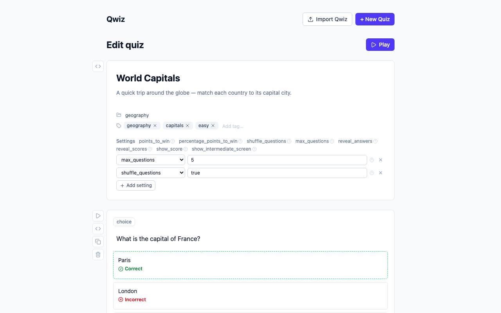

# Qwiz

[](https://github.com/gauthamchettiar/qwiz/actions/workflows/ci.yml)
[](./LICENSE)

Build and play quizzes entirely in your browser. There's no server, no accounts, and nothing
leaves your device — every quiz is saved to `localStorage` and stays there.

A quiz is written in a small Markdown-like format (`.qwiz`) covering multiple-choice and typed
questions, images/video, hints, per-option point weights, and quiz-wide scoring rules. Author
either through the form-based builder or directly in code; both stay in sync.

**Live demo**: [qwiz.gauthamchettiar.com](https://qwiz.gauthamchettiar.com)

## Screenshots

| Quiz list                                 | Builder                                    | Player                                   |
| ----------------------------------------- | ------------------------------------------ | ---------------------------------------- |
|  |  |  |

## Documentation

- [Introduction](./docs/introduction.md) — core concepts, authoring modes, import/export
- [`.qwiz` format reference](./docs/qwiz-format.md) — full authoring syntax and scoring rules

## Development

```bash
pnpm install
pnpm dev            # dev server at localhost:4321
```

## Commands

| Command              | What it does                          |
| -------------------- | ------------------------------------- |
| `pnpm dev`           | Dev server                            |
| `pnpm build`         | Static build → `dist/`                |
| `pnpm preview`       | Serve `dist/` locally                 |
| `pnpm check`         | Type-check (`astro check`)            |
| `pnpm lint`          | ESLint                                |
| `pnpm format`        | Prettier, write                       |
| `pnpm test`          | Unit tests (Vitest)                   |
| `pnpm test:coverage` | Unit tests with coverage (80% gate)   |
| `pnpm test:e2e`      | End-to-end tests (Playwright)         |
| `pnpm test:e2e:ui`   | End-to-end tests, interactive UI mode |

## Stack

Astro (static output) + Svelte 5 + Tailwind CSS v4 + zod, tested with Vitest and Playwright,
deployed to Cloudflare Pages. See [`CLAUDE.md`](./CLAUDE.md) for the full set of conventions this
codebase follows and why — architecture, testing policy, styling rules, CI/CD.

## Contributing

Issues and PRs welcome. Read [`CLAUDE.md`](./CLAUDE.md) first — it's the operating manual this
codebase actually follows (not aspirational docs), and any change should keep it accurate.

## License

[MIT](./LICENSE)
