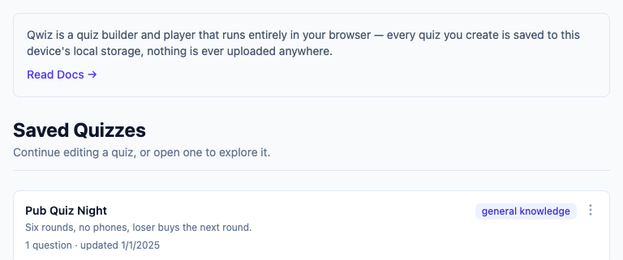
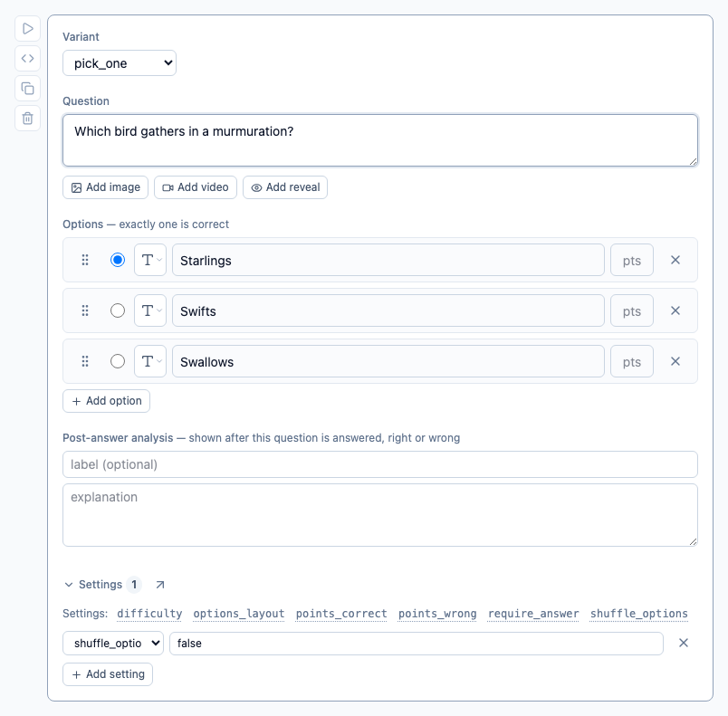
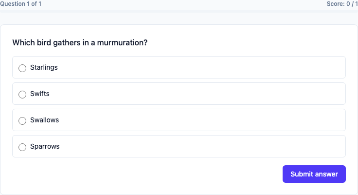

# Qwiz

[](https://github.com/gauthamchettiar/qwiz/actions/workflows/ci.yml)
[](./LICENSE)

Build and play quizzes entirely in your browser. There's no server and no accounts — every quiz you
write is saved to `localStorage` and never leaves your device. Qwiz can also open a quiz published
as a GitHub gist or repository, which is the one time it talks to anything: it reads public files,
signed out, and saves nothing unless you ask it to.

A quiz is written in a small Markdown-like format (`.qwiz`) covering multiple-choice and typed
questions, images/video, hints, per-option point weights, and quiz-wide scoring rules. Author
either through the form-based builder or directly in code; both stay in sync.

**Live demo**: [qwiz.gauthamchettiar.com](https://qwiz.gauthamchettiar.com)

## Screenshots

Your quizzes, saved in this browser and nowhere else:



Author a question through the form — every control, from the correct-answer marker to the settings
block, maps to one line of `.qwiz` source. There's a code mode for writing that source directly,
with a live preview beside it:



Then play it, and see what you got right:



That's the short version. The docs below carry the rest — code mode, the answer reveal, the
end-of-run review, the settings panel, and all nine question variants with a screenshot of how each
one plays:

- [Introduction](./docs/introduction.md) — the authoring modes, playing and reviewing, import/export
- [`.qwiz` format reference](./docs/qwiz-format.md) — every question variant, illustrated

## Documentation

- [Introduction](./docs/introduction.md) — core concepts, authoring modes, import/export
- [`.qwiz` format reference](./docs/qwiz-format.md) — full authoring syntax and scoring rules
- [Settings reference](./docs/settings.md) — every quiz-wide/per-question setting, validation
- [Complete `.qwiz` reference for LLMs](./docs/llm-reference.md) — the whole format in one
  self-contained file, written to be handed to a model that needs to generate `.qwiz` documents
- [`examples/`](./examples) — ten playable `.qwiz` files covering every variant and setting;
  loadable in-app from Import → Load a sample

## Development

```bash
pnpm install
pnpm dev            # dev server at localhost:4321
```

## Commands

| Command              | What it does                          |
| -------------------- | ------------------------------------- |
| `pnpm dev`           | Dev server                            |
| `pnpm build`         | Static build → `dist/`                |
| `pnpm preview`       | Serve `dist/` locally                 |
| `pnpm check`         | Type-check (`astro check`)            |
| `pnpm lint`          | ESLint                                |
| `pnpm format`        | Prettier, write                       |
| `pnpm test`          | Unit tests (Vitest)                   |
| `pnpm test:coverage` | Unit tests with coverage (80% gate)   |
| `pnpm test:e2e`      | End-to-end tests (Playwright)         |
| `pnpm test:e2e:ui`   | End-to-end tests, interactive UI mode |
| `pnpm screenshots`   | Regenerate the images in these docs   |

Every screenshot above and in `docs/` is generated by `pnpm screenshots`
([`screenshots/capture.spec.ts`](./screenshots/capture.spec.ts)) rather than captured by hand — run
it after any UI change that a documented screen would show, and commit the diff.

## Stack

Astro (static output) + Svelte 5 + Tailwind CSS v4 + zod, tested with Vitest and Playwright,
deployed to Cloudflare Pages. See [`CLAUDE.md`](./CLAUDE.md) for the full set of conventions this
codebase follows and why — architecture, testing policy, styling rules, CI/CD.

## Contributing

Issues and PRs welcome. Read [`CLAUDE.md`](./CLAUDE.md) first — it's the operating manual this
codebase actually follows (not aspirational docs), and any change should keep it accurate.

## License

[MIT](./LICENSE)
