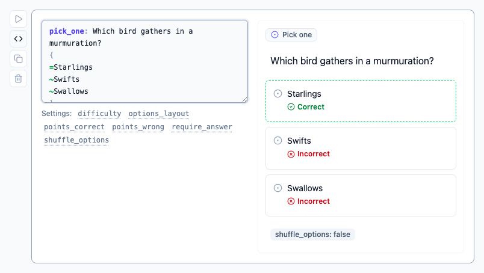
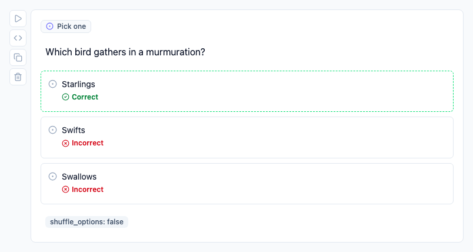
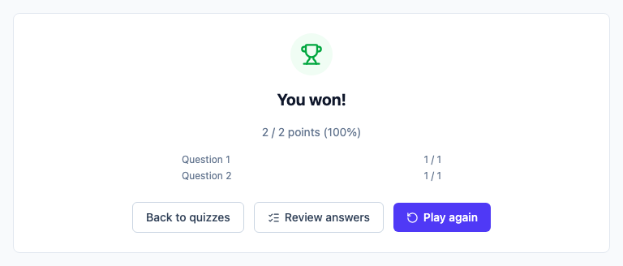
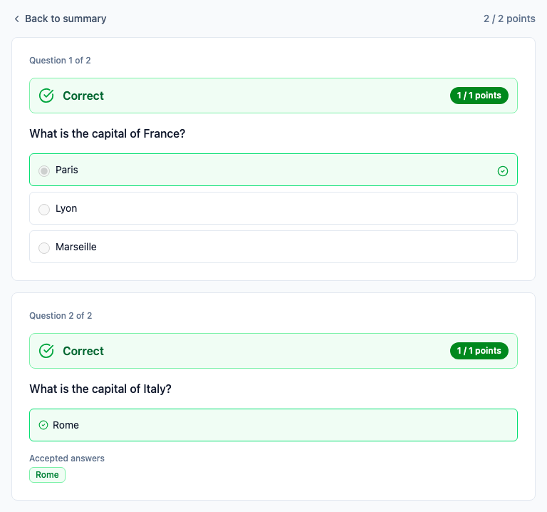
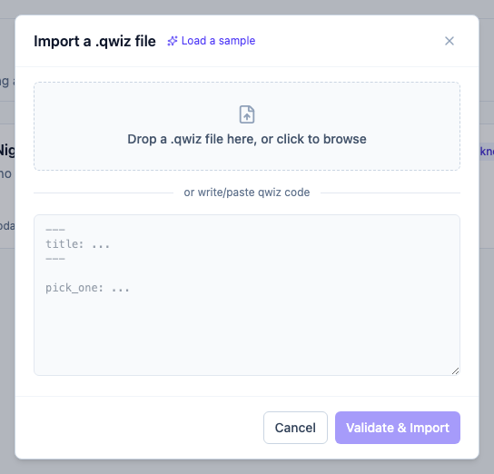

# Introduction

Qwiz builds and plays quizzes entirely in your browser. There's no account, no server, and no
sync — every quiz you create is saved to your browser's `localStorage` and never leaves your
device. Clearing your browser's site data for this domain deletes your quizzes; there's no
recovery beyond a `.qwiz` file you've exported yourself (see [Import & export](#import--export)).

## Core concepts

- **A quiz** is a title, description, category, tags, a list of questions, and a set of scoring
  settings (win threshold, shuffling, reveal timing, etc.).
- **A question** is one of nine variants — `pick_one`, `pick_many`, `type_answer`, `type_pattern`,
  `guess_letters`, `order_items`, `match_pairs`, `group_items` and `fill_blanks`. Some are picked,
  some typed, and four are placed on a board:

  

  See [the format reference](./qwiz-format.md) for the full syntax of all nine, each with a
  screenshot of how it plays.

- **Everything round-trips through one format**: the `.qwiz` plain-text format is both what you
  can hand-write in code mode and what gets exported/imported as a file. The form-based builder is
  just a UI over the same underlying source — editing a question in the form and switching to its
  code view shows the identical `.qwiz` text, always in sync.

## Authoring: form vs. code mode

Every quiz and every question can be edited two ways, and you can switch between them freely:

- **Form mode** — fill in fields (text, options, settings) through a normal UI. No syntax to
  learn; this is the default. Each option row carries its own correct marker, point weight and
  remove button, and an option's kind (text, image or video) is chosen by the button that adds it:

  

- **Code mode** — edit the question's (or the quiz metadata's) raw `.qwiz` source directly in a
  text area, with a live preview of the result beside it and the settings that apply to the
  current variant listed underneath. Faster once you know the format, and the only way to use a
  few things the form doesn't expose a control for (e.g. escaping option text that starts with
  `=`):

  

A question you aren't editing sits in **view mode** — a read-only preview shaped like the answer
itself, so a stack of them is scannable. Clicking any part of it opens the form focused there, and
a question whose source doesn't parse says so with an error count:

Switching modes never loses data — code mode is parsed back into the same form fields, and vice
versa.

## Playing a quiz

Open any saved quiz's "Play" action to start a run. Depending on the quiz's settings (see
[quiz-wide settings](./qwiz-format.md#quiz-wide-settings)), answers and scores may be revealed
after every question or held until the end, and a run may only sample a subset of the question
bank in a random order.

Every question can be submitted unanswered — Submit stays available whether the question is empty,
half-finished or complete, and a skipped question is reported as "Skipped" rather than as a wrong
answer. Authors who want an answer forced can set
[`require_answer=true`](./settings.md#per-question-settings) on a question or across the whole quiz.

A run ends with a pass/fail result against the quiz's win threshold, scored against every question
in the run:

Unless `reveal_answers=never`, a review screen then shows what you answered against what was
correct — every variant replayed through the same board you answered it on, locked:

## Import & export

Every quiz can be downloaded as a `.qwiz` file (a plain-text file — safe to read, edit by hand,
back up, or share) via its card menu. The same file can be re-imported through **Import** on
the home page, either by uploading it or pasting its contents directly. Importing always creates a
new quiz — it never silently overwrites one you already have, even if the file was originally
exported from this same browser.

The **Import** dialog also offers a few built-in sample quizzes ("Load a sample") that each
exercise a different part of the format — a quick way to see real, valid `.qwiz` source before
writing your own.

## Next

If you want a single self-contained specification — for your own reference, or to hand to a model
that should generate `.qwiz` files — see [the complete `.qwiz` reference](./llm-reference.md). The
[`examples/`](../examples) folder holds ten playable files covering every variant and setting,
loadable from Import → Load a sample.

See [the `.qwiz` format reference](./qwiz-format.md) for the full authoring syntax: question
types, media, hints, scoring settings, and every quiz-wide/per-question option.
