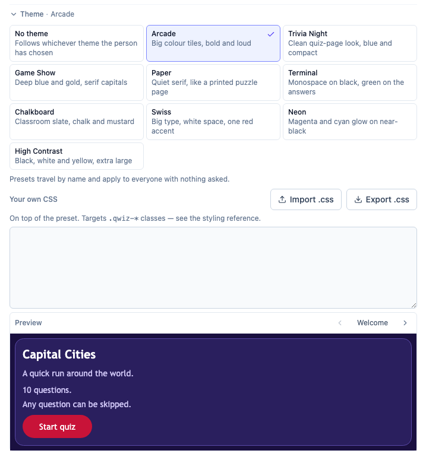

# Styling the play screen

Every element a player sees carries a `qwiz-` class. These names are a **published API**: the
built-in presets target them, and so does any `theme-css:` an author writes, so renaming one breaks
themes that already exist.

Use them from a quiz's own CSS — the **Theme** panel in the builder, or `theme-css:` in a `.qwiz`
file (see [the format reference](./qwiz-format.md#giving-a-quiz-its-own-look)).



## The shortcut: role variables

Before targeting classes, try the sixteen variables the presets themselves are built from. Setting
one re-skins everywhere it appears, which is usually what you want:

```css
:root {
  --qp-accent: #ff6b35;
  --qp-accent-ink: #ffffff;
}
```

| Variable                                                     | Where it lands                                        |
| ------------------------------------------------------------ | ----------------------------------------------------- |
| `--qp-page` / `--qp-page-ink`                                | The page behind everything, and the header text on it |
| `--qp-surface` / `--qp-surface-ink`                          | Cards, results, the leave dialog                      |
| `--qp-surface-ink-muted`                                     | Progress, score, descriptions, rules                  |
| `--qp-panel` / `--qp-panel-ink`                              | Options, the verdict banner, inputs                   |
| `--qp-border`                                                | Every edge                                            |
| `--qp-accent` / `--qp-accent-ink`                            | Buttons, the progress fill, a selected option         |
| `--qp-correct` / `--qp-correct-surface` / `--qp-correct-ink` | A right answer                                        |
| `--qp-wrong` / `--qp-wrong-surface` / `--qp-wrong-ink`       | A wrong one                                           |
| `--qp-font` / `--qp-heading-font` / `--qp-radius`            | Type and corner rounding                              |

**Keep every ink/background pair at 4.5:1 or better.** The shipped presets are measured against
that in `playPresets.test.ts`, at rest _and_ hovered; yours aren't, so it's on you.

## The classes

### Chrome and layout

| Class           | What it is                                     |
| --------------- | ---------------------------------------------- |
| `.qwiz-chrome`  | The header strip above a run                   |
| `.qwiz-back`    | The Back link                                  |
| `.qwiz-home`    | The Home button                                |
| `.qwiz-welcome` | The whole welcome panel, before the run starts |
| `.qwiz-card`    | The question card during a run                 |
| `.qwiz-dialog`  | The "leave this quiz?" confirmation            |

### Welcome screen

| Class               | What it is                                      |
| ------------------- | ----------------------------------------------- |
| `.qwiz-title`       | The quiz's title                                |
| `.qwiz-description` | Its description                                 |
| `.qwiz-rules`       | The "How this quiz works" list (`li` too)       |
| `.qwiz-start`       | The Start button                                |
| `.qwiz-trust`       | The prompt shown before running an author's CSS |

### During a question

| Class                    | What it is                                              |
| ------------------------ | ------------------------------------------------------- |
| `.qwiz-progress`         | "Question 3 of 10"                                      |
| `.qwiz-score`            | The running score                                       |
| `.qwiz-progressbar`      | The bar's track                                         |
| `.qwiz-progressbar-fill` | The filled portion                                      |
| `.qwiz-question`         | One question, whole                                     |
| `.qwiz-question-text`    | The question's own text                                 |
| `.qwiz-options`          | The container holding a choice question's options       |
| `.qwiz-option`           | One option — a `<label>` wrapping a real radio/checkbox |
| `.qwiz-option-label`     | The text inside it                                      |
| `.qwiz-option--selected` | …that the player has picked                             |
| `.qwiz-option--correct`  | …revealed as correct                                    |
| `.qwiz-option--wrong`    | …picked and wrong                                       |
| `.qwiz-submit`           | Submit answer                                           |
| `.qwiz-next`             | Next question / See results                             |

### After answering

| Class                   | What it is                                     |
| ----------------------- | ---------------------------------------------- |
| `.qwiz-verdict`         | The "Correct" / "Not quite" / "Skipped" banner |
| `.qwiz-verdict-label`   | Its wording                                    |
| `.qwiz-verdict-score`   | The points pill beside it                      |
| `.qwiz-results`         | The end-of-run card                            |
| `.qwiz-results-head`    | Its top band, behind the score ring            |
| `.qwiz-results-percent` | The percentage                                 |
| `.qwiz-results-title`   | "You won!" / "Quiz complete"                   |
| `.qwiz-back-to-summary` | The link out of the review                     |
| `.qwiz-review`          | Each question's card in the review list        |

The state classes sit **alongside** `.qwiz-option`, never replacing it: `.qwiz-option` styles every
option, `.qwiz-option--correct` only the revealed-correct ones.

## Notes that will save you time

- **Your rules are appended after the app's stylesheet**, so a single class beats a Tailwind
  utility of the same specificity without `!important`.
- **A preset applies first, your CSS second.** You're overriding it, not fighting it.
- **Don't use `transparent` for an option background.** Hover blends the option's colour toward its
  ink, and a keyword can't be blended — it produces a translucent dark under dark text. Use the
  surface colour instead; it looks identical and survives the mix.
- **Hover is handled for you** if you set colours through the role variables. Override
  `.qwiz-option:hover` directly and you own its legibility.
- **The option's `<input>` is real.** Loud presets hide it (`.qwiz-option input { display: none }`)
  and treat the tile as the control; quiet ones leave it visible. Hiding it costs nothing in
  accessibility — the `<label>` still labels it.
- **`:nth-child()` works on `.qwiz-options`.**
- **Anything you don't set falls back to the app's default light theme**, not to the player's own —
  a themed run parks `data-theme` so the same quiz looks the same for everyone.

## When your colour doesn't apply

Some elements carry their own semantic colour class (`.qwiz-rules li` is muted, image captions are
subtle). Setting `color` on the container won't reach them, because an explicit colour on a child
beats an inherited one. Name the child:

```css
.qwiz-rules,
.qwiz-rules li {
  color: #cfc6f5;
}
```

Option text is the exception and inherits normally, so `.qwiz-option { color: #fff }` is enough.

## Example

```css
.qwiz-question-text {
  font-family: Georgia, serif;
  font-size: 1.5rem;
}

.qwiz-option {
  border-radius: 999px;
  padding: 1rem 1.25rem;
}

.qwiz-option--correct {
  --qp-option-bg: #e6f4ea;
  --qp-option-ink: #125524;
}
```
