# `.qwiz` format reference

`.qwiz` is a small, Markdown-like plain-text format for authoring a quiz: one frontmatter block
followed by one or more questions, each separated by a blank line.

```
---
title: World Capitals
description: A quick trip around the globe.
category: geography
tags: [geography, capitals, easy]
:questions_per_run=5
:shuffle_questions=true
---

pick_one: What is the capital of France?
{
=Paris
~London
~Berlin
}

type_answer: What is the capital of Japan?
{
=Tokyo
}
:typo_tolerance=15
```

This is real, importable source — paste it into **Import** to try it. More full examples of
every feature below are built into the app itself (Import → "Load a sample").

## Frontmatter

The block between the two `---` lines. All fields are optional.

| Field         | Value                                                 |
| ------------- | ----------------------------------------------------- |
| `title`       | Plain text                                            |
| `description` | Plain text (a literal newline is written as `\n`)     |
| `category`    | Plain text                                            |
| `tags`        | Inline array: `tags: [one, two, three]`               |
| `:key=value`  | Quiz-wide settings — see [below](#quiz-wide-settings) |

## Quiz-wide settings

Written as `:key=value` lines inside the frontmatter block. Full reference — every key, its type
and default, and how settings behave in combination — lives in
[`settings.md`](./settings.md#quiz-wide-settings), kept as the one place this is documented rather
than a second copy here that could drift. In brief: win threshold (`points_to_win`/
`percent_to_win`), ordering/sampling (`shuffle_questions`, `questions_per_run`), reveal
timing (`reveal_answers`, `reveal_scores`, `show_running_score`, `show_reveal_screen`), and time
limits (`timer_mode`, `timer_seconds`, `on_timeout`, `reveal_screen_seconds`).

## Questions

Each question is one blank-line-separated block. Only the question's **text** and its `{ }`
**option block** are required — everything else is optional.

### Variant

Two ways to declare a question's type, both equivalent:

```
pick_one: What is H2O?
```

```
variant : pick_one
What is H2O?
```

Recognized variants:

- **`pick_one`** — pick exactly one option. Exactly one `=` is required; more than one is a
  parse error. Always renders as a radio group.
- **`pick_many`** — pick one or more options. Any number of `=` (one or more). Always
  renders as checkboxes.
- **`type_answer`** — type a free-text answer, matched against one or more accepted answers.
- **`type_pattern`** — type a free-text answer, graded against regular expressions rather than
  literal answers — see [`type_pattern`](#type_pattern) below.
- **`guess_letters`** — guess a word letter-by-letter from an on-screen bank, Hangman-style —
  see [`guess_letters`](#guess_letters) below.
- **`order_items`** — drag (or tap-to-pick-then-tap-to-place) items into the correct sequence — see
  [`order_items`](#order_items) below.
- **`match_pairs`** — pair up items from a left column with items from a right column — see
  [`match_pairs`](#match_pairs) below.
- **`group_items`** — sort items into buckets, several items per bucket — see
  [`group_items`](#group_items) below.
- **`fill_blanks`** — fill in blanks in the question text from a word bank or by typing — see
  [`fill_blanks`](#fill_blanks) below.

Omitting a variant entirely defaults to the same behavior as `pick_many`.

Every variant below is shown as the player actually sees it. The four placement variants
(`order_items`, `match_pairs`, `group_items`, `fill_blanks`) are pictured mid-answer rather than
untouched, since what they do only becomes clear once something has been placed.

| `pick_one`                                            | `pick_many`                                             |
| ----------------------------------------------------- | ------------------------------------------------------- |
| 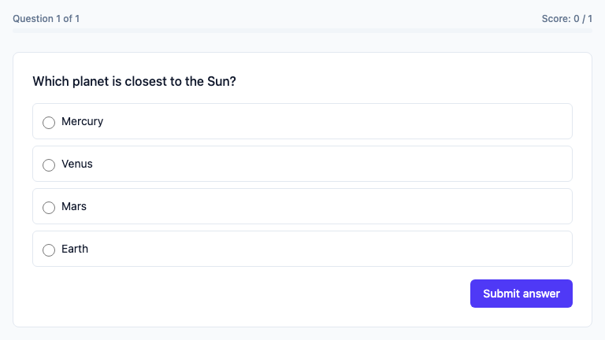       | 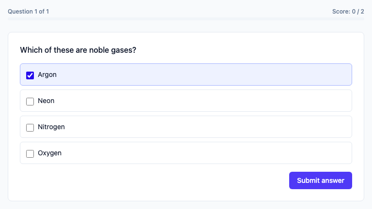       |
| `type_answer`                                         | `type_pattern`                                          |
| 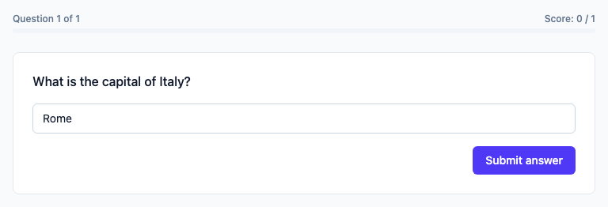 |  |

### Options block

```
{
=correct option
~wrong option
=Water %4%
}
```

- Every line starts with `=` (correct/accepted) or `~` (incorrect) — one option per line.
- `pick_one` allows at most one `=` line; `pick_many` allows any number (one or more).
- An optional trailing `%N%` sets that option's own point value, overriding the question's
  `point`/`penalty` settings for just that option — e.g. `=Water %4%`, `~Salt %-1%`.
- An option's content can be an image or video, using the same syntax as question-level media
  (below) — e.g. `=`.
- **`type_answer` questions**: every option is an accepted answer, matched against what the player
  types — the `=`/`~` marker doesn't matter (both are accepted purely for authoring convenience,
  and the parser forces every option `correct: true`). An accepted answer must be plain text — an
  image/video option is a parse error, since matching is always a text comparison.
- **`guess_letters` questions**: exactly one plain-text accepted answer (a second `=` line is a
  parse error — the guess mechanic is one fixed board of boxes/pre-reveals, so there's nothing a
  second answer could represent), marker ignored, image/video rejected — plus the `[X]` pre-reveal
  bracket syntax described below.

### Question-level media

```

!<image>[alt text](https://example.com/image.jpg)
!<youtube>[alt text](https://www.youtube.com/watch?v=...)
```

`![...]` and `!<image>[...]` are equivalent — plain image syntax is just a shorter alias. Video has
no bare-marker alias; it's always `!<youtube>[...]`.

An image renders above the options, at the question's own full width:

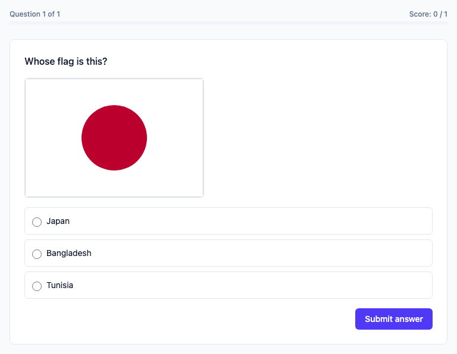

### Hints

```
!<reveal>[Need a hint?](It's in Paris, France.) %-1%
```

A question-level hint: `label` is shown before it's revealed, `content` after, and the optional
trailing `%N%` is its reveal cost (omit for a free hint). Can be written alongside the media lines
above the option block, or interspersed among the `=`/`~` lines inside it — either way it's a
hint for the whole question, never tied to whichever option it's physically next to.

Revealed, with its cost shown before the player commits to it:

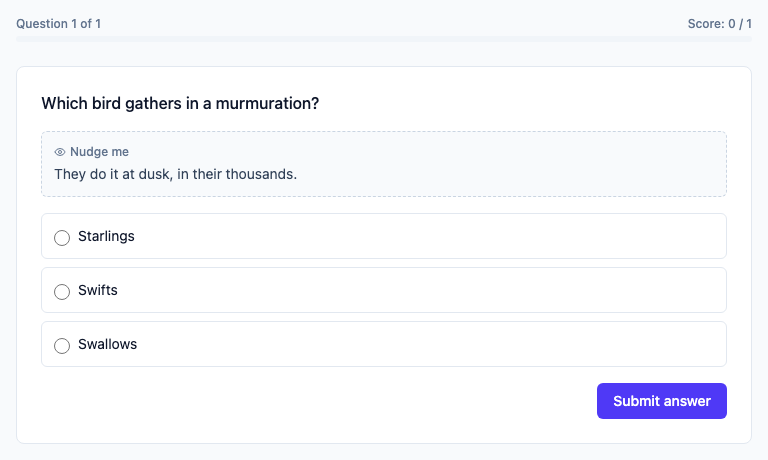

### Post-question analysis

```
!<analysis>[Why?](Water boils at 100°C at sea level because that's when its vapor pressure
equals atmospheric pressure.)
```

A question's post-answer explanation: shown on the intermediate/reveal screen once the question
is locked in, regardless of whether the player got it right or wrong — unlike a hint (above),
it's never player-triggered and never shown before answering, so it takes no `%N%` cost. Written
alongside the media lines above the option block; unlike hints, it can't be interspersed inside
`{ }`. At most one per question — a second `!<analysis>[...]` line is a parse error. `label` is
optional (defaults to "Why?" when shown); `content` is the explanation itself.

Only appears on the per-question intermediate screen (`show_reveal_screen`, gated the same
way as live `reveal_answers`/`reveal_scores` — see [below](#quiz-wide-settings)) — it's never
shown on the end-of-quiz Review screen for quizzes that defer reveal to the end.

A wrong answer, revealed: the verdict banner, the correct option tinted green against the picked
one in red, and the analysis underneath.

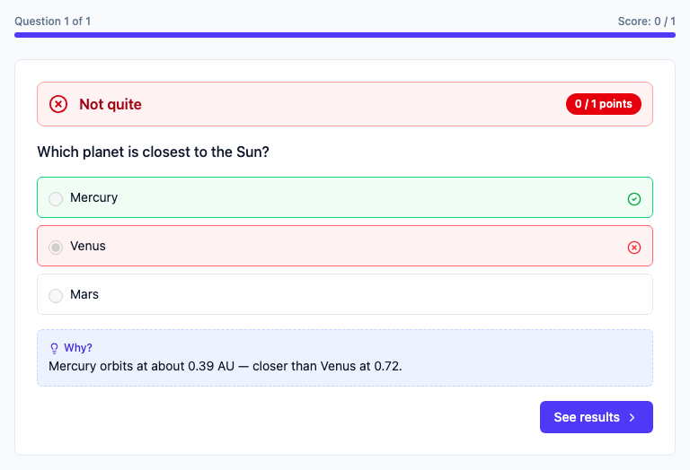

### `order_items`

`order_items` presents a set of items and asks the player to arrange them into the correct sequence —
the order they're written in `{ }` IS the answer key, so it's never shown to the player unshuffled.

```
order_items: Arrange chronologically
{
=First
=Second
=Third
}
```

- Every line starts with `=` — the `=`/`~` marker doesn't matter (both are accepted purely for
  authoring convenience, same as `type_answer`), since every listed item is implicitly part of the
  sequence; there's no "wrong item," only a wrong position.
- At least 2 items are required — a single item has no meaningful order.
- An item's content can be an image or video, using the same syntax as question-level media —
  ordering pictures (e.g. "arrange these photos chronologically") is a real use case, unlike
  `type_answer`/`guess_letters` where content must always be plain text.
- Played by tapping an item to pick it up, then tapping a numbered position to place it (or
  tapping a filled position to swap) — works identically via mouse, touch, or keyboard
  (Tab + Enter/Space), with no drag gesture required.

One item placed, the rest still in the pool:

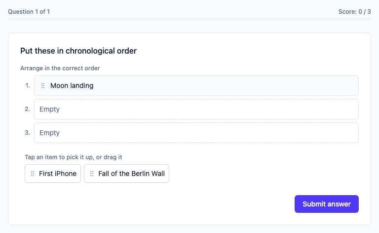

### `match_pairs`

`match_pairs` presents two columns and asks the player to pair up each left-side item with its matching
right-side entry — a 1-to-1 pairing, every target used exactly once.

```
match_pairs: Match the capital to its country
{
=Paris -> France
=Tokyo -> Japan
=Berlin -> Germany
}
```

- Every line is `item -> target`, split on the first `" -> "` — quote or backslash-escape the
  line (see [Escaping](#escaping)) if an item's own text genuinely needs to contain that.
- At least 2 pairs are required, and every target must be unique — two items can't both correctly
  pair with the same target (that's what [`group_items`](#group_items) is for).
- Either side can be an image or video instead of text, written the same
  `` / `!<youtube>[alt](url)` way as anywhere else — matching a photograph to a name, a
  name to a photograph, or one picture to another are all valid:

  ```
  match_pairs: Match the landmark to its city
  {
  = -> Paris
  =Colosseum -> 
  }
  ```

  Uniqueness compares the whole target, so two pictures with different URLs are two distinct
  targets even if their alt text matches.

- Played the same tap-to-pick-then-tap-to-place way as `order_items`: tap a left item, then tap a right
  target to pair them (or tap an already-paired target to steal it for the currently-picked item).

A paired item shows the numbered right-column entry it went to, so a board of several pairs stays
readable:

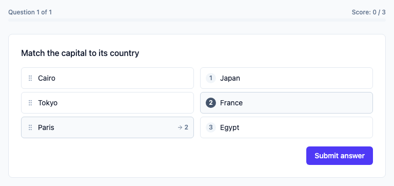

With pictures on the left and names on the right — either column can hold either:

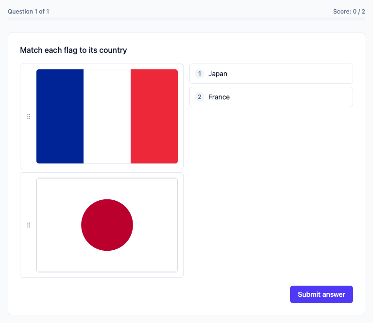

### `group_items`

`group_items` presents a set of items and a set of buckets, and asks the player to sort each item
into its correct bucket — unlike `match_pairs`, several items can correctly share one bucket.

```
group_items: Sort these animals by habitat
{
=Fish -> Water
=Frog -> Water
=Lion -> Land
=Eagle -> Air
}
```

- Same `item -> target` syntax as `match_pairs`, but `target` is a bucket name here, not a unique
  pairing partner — the buckets shown to the player are simply the distinct set of targets across
  every option (there's no separate bucket-naming syntax). Repeating a target across several
  options is expected, not an error.
- At least 2 items are required.
- An `item` can be an image or video, same as in `match_pairs` — but a `target` here must be plain
  text, and an image/video bucket is a parse error. A bucket label is the identity several items
  share, which only works for something that reads as one name.
- Played by tapping an item to pick it up, then tapping a bucket to place it there (or tapping an
  already-placed item to pick it back up).

Each bucket is a tray with a live count, and unplaced items wait in a pool below:

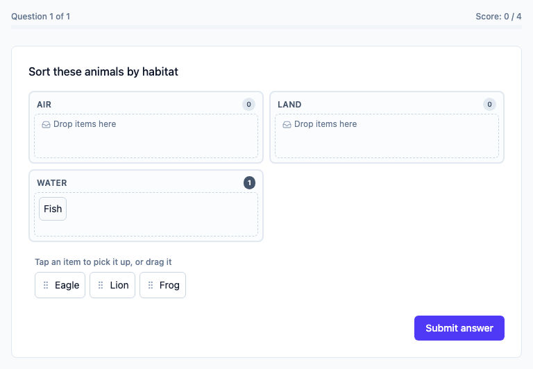

### `fill_blanks`

`fill_blanks` embeds one or more blanks directly in the question text and asks the player to
fill each one, either by picking words from a bank or by typing.

```
fill_blanks: The ___ is the powerhouse of the ___.
{
=mitochondria
=cell
~nucleus
}
:answer_mode=pick
```

- Blanks are `___` (three underscores) tokens written directly in the question text — the number
  of `___` tokens must exactly match the number of correct (`=`) options, since each one is filled,
  left to right, by the correct options in the order they're written.
- `~` options don't fill any blank — they're extra distractor words added to the bank, same
  purpose as `letter_bank=auto`'s decoy letters in `guess_letters`: without them, every bank pick
  would be a guaranteed-right word with no risk to it.
- `answer_mode` (per-question setting, see [below](#per-question-settings)) controls how a blank is
  filled: `pick` (default) — tap a bank word, then tap a blank to place it (same tap-to-place
  interaction as `order_items`/`match_pairs`/`group_items`), matched exactly since the player picked it
  verbatim. `type` — a plain inline text field per blank, matched the same way a `type_answer` question's
  response is (`match_case`/`number_tolerance`/`typo_tolerance` all apply).
- A blank answer or distractor can be an image or video, so a bank of pictures can be dropped into
  the sentence. Under `answer_mode=type` there's no bank to pick from, and a picture blank has to
  be typed as its alt text instead — one with no alt text at all is a parse error there, since
  nothing could ever be typed to match it.

One blank filled from the bank, one still empty. A word that's been placed is greyed out below:

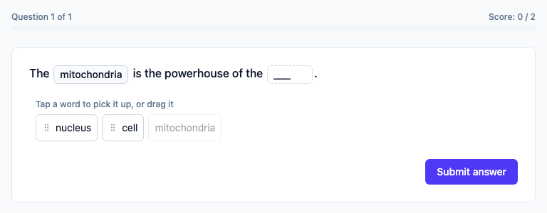

### `type_pattern`

Free text like `type_answer`, but every option is a **regular expression**:

```
type_pattern: Give any year in the 1990s.
{
=199[0-9]
~19[0-9]{2}
}
```

Unlike every other variant, both markers are load-bearing: `=` patterns say what counts as correct,
`~` patterns explicitly mark a response wrong (and may carry their own `%N%` penalty, as above).
At least one `=` pattern is required, and a pattern that doesn't compile is a parse error rather
than one that silently never fires.

- **Implicitly anchored** — the pattern must match the whole response, so `cat` matches "cat" and
  not "concatenate". Use `.*cat.*` for a genuine substring match.
- **A matching `~` beats a matching `=`**, so `=.+` with `~[Pp]aris` reads as "anything but Paris".
- **The response is trimmed but not normalised.** `type_answer`'s accent-folding and
  punctuation-stripping would destroy the very characters a pattern like `[0-9]+\.[0-9]+` exists to
  match, so they don't apply here. `match_case` still does — patterns are case-insensitive by
  default.

Exactly one pattern ever resolves, so a question's maximum is its best single `=` pattern, not the
sum. `typo_tolerance`, `number_tolerance` and `typed_input` don't apply.

### `guess_letters`

`guess_letters` guesses a single accepted answer letter-by-letter via an on-screen bank —
Hangman, in other words.

```
guess_letters: Guess the capital of France
{
=[P]aris
}
:letter_bank=alphabet
:letter_reveal=all
:points_wrong=-1
```

- **`[X]` pre-reveal brackets**: wrap a character in `[ ]` inside the accepted-answer line to
  reveal it from the start, free of charge — `=[P]aris` pre-reveals "P". Multiple markers are
  fine: `=[P]a[r]is`. Only meaningful on the first accepted answer (if more than one is given, the
  rest are just alternate matches, same as `type_answer`). Form mode offers the same thing as a row of
  clickable letter buttons under the answer field, instead of typing brackets directly.
- Only `\p{L}` Unicode letters are ever guessable — spaces, punctuation, and digits in the answer
  are always shown and never count toward scoring, same as a real Hangman board doesn't ask you to
  guess the spaces between words.
- The bank offers a set of letters controlled by `letter_bank` (see the settings table below); the
  player clicks/taps one to guess it.

Mid-round: `M` was pre-revealed with `[M]`, `E` and `R` were guessed correctly (green), `Z` wasn't
(red), and every non-letter is shown for free:

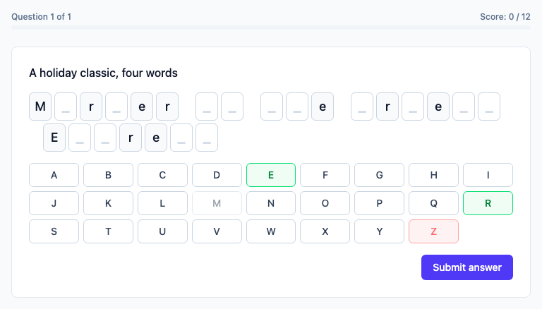

### Per-question settings

Written as `:key=value` lines, before or after the option block. Full reference — every key, its
type/default/applicable variant(s), and how settings behave in combination (which combinations are
rejected, which are harmless no-ops, and which are valid but non-obvious) — lives in
[`settings.md`](./settings.md#per-question-settings). In brief: scoring (`point`, `penalty`,
`partial_credit`), answering (`require_answer`, `min_answers`, `max_answers`), choice-only display
(`options_layout`, `shuffle_options`), typed matching (`match_case`, `number_tolerance`,
`typo_tolerance`, `typed_input`), and guess_letters's own (`letter_bank`,
`letter_bank_chars`, `letter_reveal`, `letters_shown_at_start`). `options_layout` accepts `list`,
`grid2x2` (a fixed 2-column grid), and `grid3x3` (2 columns on narrow screens, 3 on wider ones).

Any per-question setting except `min_answers`, `max_answers` and `difficulty` can also be set once
in the quiz frontmatter as a default that individual questions override — see
[Settings](./settings.md#quiz-wide-defaults-for-per-question-settings).

A setting outside its applicable variant is a parse error, not a silent no-op — e.g. `shuffle_options` on
a `type_answer` question, or `letter_bank` on a `pick_many` question. `min_answers`, `max_answers`,
and `partial_credit` are also rejected on `pick_one` — it can only ever have zero or one
option selected, so none of the three mean anything for it.

## Scoring

- **Effective points** for an option: its own `%N%` weight if given, else the question's
  `point`/`penalty` default for correct/incorrect respectively, else `1` (correct) or `0`
  (incorrect).
- **Exact match (default, `partial_credit=false`)**: all-or-nothing — every correct
  option/accepted answer must be picked/matched, with nothing extra, or the question scores `0`.
- **Partial credit (`partial_credit=true`)**: each pick/guess is scored independently and summed.
  Achievable max is capped by `max_answers` when set — e.g. 3 correct options worth 1 point each
  with `max_answers=2` tops out at 2, not 3.
- **Hints**: a revealed hint's (usually negative) cost is added to the question's earned score;
  its cost only counts toward the achievable max if positive (a hint that can only cost points
  never inflates the max).
- **Typed matching**: always trimmed, accent-folded, and punctuation-stripped before comparing
  (unless `number_tolerance` applies, checked first against the untouched values so "3.14" isn't
  corrupted by punctuation-stripping). Case-insensitive unless `match_case=true`.
- **Character input**: scored per DISTINCT guessable letter, not per occurrence — guessing "e" in
  a word where it appears three times is one scoring event, regardless of `letter_reveal`. A
  correctly-guessed letter earns `point`; a wrong guess costs `penalty`. Pre-revealed letters
  (`[X]` brackets or `letters_shown_at_start`) count toward neither earned nor achievable max — they were
  free, so they don't inflate either side.
- **Winning a run**: `points_to_win` (an absolute score) if set, else `percent_to_win`
  (default `75`) against that run's own achievable max.

## Escaping

Two ways to force a line — or an option's content after its `=`/`~` marker — to be read as
literal text, bypassing every other special syntax (media, hints, point weights, settings):

- **Quote the whole thing**: `"50% off, no really"`
- **Escape just the leading character**: `\=5` for text that starts with a literal `=`

Both are equivalent; use whichever reads better for a given piece of content.

## Full examples

Also available in-app via Import → "Load a sample".

**Choice/typed scoring** (multi-select partial credit, per-option weights, typed matching) — also
via "Load a sample" → **Advanced Scoring**:

```
---
title: Advanced Scoring
description: Multi-select partial credit and per-option point weights.
category: demo
tags: [demo, scoring]
:points_to_win=15
---

pick_many: Which of these are primary colors? (select all that apply)
:partial_credit=true
{
=Red %3%
=Green %3%
=Blue %3%
~Purple
}
:difficulty=easy

type_answer: What is the capital of France? (typo-tolerant)
:typo_tolerance=20
{
=Paris
=paris
}
```

**Character input** (pre-reveal, letter bank, penalty) — also via "Load a sample" →
**Hangman Challenge**:

```
---
title: Hangman Challenge
description: Guess each word one letter at a time. A wrong guess costs a point.
category: demo
tags: [demo, guess_letters]
---

guess_letters: Guess the capital of France (one letter pre-revealed)
{
=[P]aris
}
:letter_bank=alphabet
:letter_reveal=all
:points_wrong=-1
```
