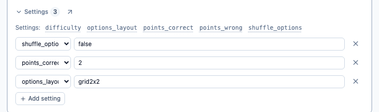
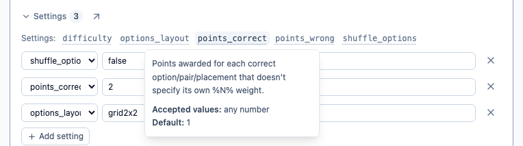

# Settings reference

Every setting is a `:key=value` line — quiz-wide ones inside the frontmatter's `--- ... ---`
block, per-question ones after (or before) a question's `{ }` option block. Both use the same
syntax and the same validation path (`validateSettingValue` in `quizScript.ts`), and both are a
**closed set**: a key not listed here is a parse error, not a freeform pass-through.

This is the single dedicated reference for what each setting does. [`qwiz-format.md`](./qwiz-format.md)
covers the surrounding authoring syntax (variants, options, media, hints); this file covers
settings in depth, including how they behave _together_, not just individually.

## In the builder

You don't have to write `:key=value` by hand. Both the quiz card and every question card carry a
collapsed **Settings** block; opening it lists the keys that apply here (a question's list is
scoped to its variant, so a `pick_one` question is never offered `letter_bank`), and each row is a
key dropdown plus a value field validated as you type:



Every key in that list is also its own explanation — click one for what it does, what values it
accepts, and what it defaults to. It's the same text as the tables below:



The `↗` beside the Settings toggle opens this page.

## Quiz-wide settings

Written inside the frontmatter block.

Listed alphabetically, matching the order the key dropdown offers them in.

| Key                     | Type                                          | Default                           | Meaning                                                                                                                     |
| ----------------------- | --------------------------------------------- | --------------------------------- | --------------------------------------------------------------------------------------------------------------------------- |
| `on_timeout`            | `auto_submit` \| `lock_zero`                  | `auto_submit`                     | What happens to a question still being answered when its clock reaches zero                                                 |
| `percent_to_win`        | number                                        | `75`                              | % of max achievable score needed to win, if `points_to_win` isn't set                                                       |
| `points_to_win`         | number                                        | — (uses `percent_to_win` instead) | Absolute score a player must reach to win                                                                                   |
| `questions_per_run`     | number                                        | — (all shown)                     | Max questions sampled per run, when the bank is larger                                                                      |
| `reveal_answers`        | `after_every_question` \| `at_end` \| `never` | `after_every_question`            | When correct answers become visible                                                                                         |
| `reveal_scores`         | `after_every_question` \| `at_end` \| `never` | `after_every_question`            | When points earned become visible (independent of `reveal_answers`)                                                         |
| `reveal_screen_seconds` | number                                        | — (none)                          | Seconds the reveal screen waits before auto-advancing to the next question. Requires `show_reveal_screen` to not be `false` |
| `show_reveal_screen`    | boolean                                       | `true`                            | Pause on a per-question reveal screen before advancing. Cannot be `false` while `reveal_answers=after_every_question`       |
| `show_running_score`    | boolean                                       | `true`                            | Persistent running score header during the run                                                                              |
| `shuffle_questions`     | boolean                                       | `true`                            | Randomize question order each run                                                                                           |
| `timer_mode`            | `off` \| `per_question` \| `per_quiz`         | `off`                             | Whether answering is under a time limit, and how it's scoped. Requires `timer_seconds`                                      |
| `timer_seconds`         | number                                        | — (none)                          | Seconds on the clock — per question, or for the whole run, per `timer_mode`. Only read when `timer_mode` isn't `off`        |

## Per-question settings

Written after (or before) a question's `{ }` option block.

Alphabetical, as above. **Inherits** is whether the key may also be set once quiz-wide as a
default for every question (see [the section below](#quiz-wide-defaults-for-per-question-settings)).
"placement variants" is shorthand for the four that place things rather than select them:
`order_items`, `match_pairs`, `group_items`, `fill_blanks`.

| Key                      | Type                             | Applies to                                     | Default    | Inherits | Meaning                                                                                                          |
| ------------------------ | -------------------------------- | ---------------------------------------------- | ---------- | -------- | ---------------------------------------------------------------------------------------------------------------- |
| `answer_mode`            | `pick` \| `type`                 | placement variants                             | `pick`     | yes      | Use the on-screen board (tap/drag) vs. type each answer directly                                                 |
| `difficulty`             | `easy` \| `medium` \| `hard`     | all variants                                   | — (none)   | no       | Informational only, doesn't affect grading or play                                                               |
| `letter_bank`            | `alphabet` \| `auto` \| `fixed`  | `guess_letters`                                | `alphabet` | yes      | Which letters appear in the bank                                                                                 |
| `letter_bank_chars`      | text                             | `guess_letters`                                | — (none)   | yes      | Exact letters offered — only read when `letter_bank=fixed`                                                       |
| `letter_reveal`          | `all` \| `sequence` \| `random`  | `guess_letters`                                | `all`      | yes      | How a correct guess reveals repeated letters                                                                     |
| `letters_shown_at_start` | number                           | `guess_letters`                                | `0`        | yes      | Extra random characters revealed free at the start                                                               |
| `match_case`             | boolean                          | `type_answer`, placement variants              | `false`    | yes      | Require exact letter case                                                                                        |
| `max_answers`            | number                           | `pick_many`, `type_answer`                     | — (none)   | no       | Maximum selections/guesses allowed. `>1` on a `type_answer` question enables multi-guess mode                    |
| `min_answers`            | number                           | `pick_many`, `type_answer`                     | — (none)   | no       | Minimum selections/guesses required before submitting                                                            |
| `number_tolerance`       | number                           | `type_answer`, placement variants              | — (off)    | yes      | Allowed absolute numeric difference. Mutually exclusive with `typo_tolerance`                                    |
| `options_layout`         | `list` \| `grid2x2` \| `grid3x3` | `pick_one`, `pick_many`                        | `list`     | yes      | Option layout — `grid2x2` is a fixed 2-column grid, `grid3x3` is 2 columns on narrow screens and 3 on wider ones |
| `partial_credit`         | boolean                          | `pick_many`, `type_answer`, placement variants | `false`    | yes      | Award credit for some (not all) correct picks/guesses/placements instead of requiring an exact match             |
| `points_correct`         | number                           | all variants                                   | `1`        | yes      | Points for each correct option/answer/letter/placement without its own `%N%`                                     |
| `points_wrong`           | number                           | all variants                                   | `0`        | yes      | Points deducted for each incorrect option/wrong guess without its own `%N%`                                      |
| `shuffle_options`        | boolean                          | `pick_one`, `pick_many`                        | `false`    | yes      | Randomize this question's option order each run                                                                  |
| `typed_input`            | `text` \| `boxes`                | `type_answer`                                  | `text`     | yes      | Plain text box vs. one box per character                                                                         |
| `typo_tolerance`         | number                           | `type_answer`, placement variants              | — (off)    | yes      | Allowed typos as % of answer length (edit distance). Mutually exclusive with `number_tolerance`                  |

`match_case`, `number_tolerance` and `typo_tolerance` are accepted on the placement variants but
only do anything there under `answer_mode=type` — with `answer_mode=pick` there's no typed text for
them to compare, so they're a silent no-op rather than an error.

`pick_one` and `pick_many` differ in how many `=` options are allowed and whether they
render as a radio group or checkboxes (see `qwiz-format.md`'s
[Variant](./qwiz-format.md#variant) section) — but not in which settings apply to them, except
`min_answers`/`max_answers`/`partial_credit`, which are `pick_many`-only (see below).

## How validation works

- **Unrecognized key** → parse error listing the valid keys (`validateSettingValue`).
- **Wrong variant** → parse error naming which variant(s) the key actually applies to (checked
  against each `SettingRule`'s `appliesTo` in `quizScript.ts` — one list per setting, since a
  setting can span more than one group, e.g. `options_layout` spans `pick_one` and
  `pick_many` but neither `type_answer` nor `guess_letters`).
- **Wrong type/value** → parse error naming what was expected (a number, `true`/`false`, or one of
  an enum's fixed values).

Code mode and the settings form field share this exact same validation — neither can drift ahead
of the other into accepting something the other would reject.

## Setting interactions

Combinations that are validated, silently harmless, or genuinely worth knowing about — each of
these was actually exercised against the real parser/grading code, not assumed.

### Rejected combinations (parse errors)

- **`number_tolerance` + `typo_tolerance`** on the same question — pick one matching strategy.
- **`min_answers` > `max_answers`** — an unsatisfiable range.
- **`max_answers` below the number of correct options/accepted answers, without `partial_credit`**
  — makes an exact match impossible; the question could only ever score 0.
- **`reveal_answers=after_every_question` + `show_reveal_screen=false`** (quiz-wide) —
  revealing which options were correct needs a real screen, not just a flash.
- **`pick_one` with more than one `=`** — use `pick_many` instead.
- **`guess_letters` with more than one `=`** — the guess mechanic is one fixed board of
  boxes/pre-reveals, so a second accepted answer has nothing to represent it.
- **`min_answers`, `max_answers`, or `partial_credit` on a `pick_one` question** —
  `pick_one` can only ever have zero or one option selected, so there's no "some but not all"
  or "more than one" for any of the three to mean anything for. Use `pick_many` instead if
  the question genuinely needs them.
- **`letter_bank=fixed` with no (or no letter-containing) `letter_bank_chars`** — would produce a
  completely empty bank: an unplayable question with nothing to click, not just a degraded one.
  `letter_bank_chars=123` (digits only) is caught too, not just an empty string.
- **`points_to_win` + `percent_to_win` both set** (quiz-wide) — `points_to_win` always
  wins (see `gradeRun`), so the percentage one would be silently dead. Same category of "two
  things that can't both take effect" as the `number_tolerance`/`typo_tolerance` conflict above,
  just at the quiz level instead of per-question.
- **`timer_mode` set to `per_question` or `per_quiz` without `timer_seconds`** (quiz-wide) — a
  timer needs a duration to count down from.
- **`timer_mode=per_question` without `reveal_answers` or `reveal_scores` set to
  `after_every_question`** (quiz-wide) — a per-question time limit only makes sense alongside
  "submitting a question locks it in immediately", which is exactly what that combination already
  means. `timer_mode=per_quiz` has no such requirement — it just ends the whole run when the
  shared budget runs out, regardless of navigation mode.
- **`reveal_screen_seconds` set while `show_reveal_screen=false`** (quiz-wide) —
  there's no reveal screen to auto-advance from.

### Allowed but a no-op

- **`number_tolerance` + `match_case`** — `match_case` is ignored once numeric comparison
  kicks in, since numbers have no case. Only affects the fallback text comparison when either side
  isn't actually numeric.

### Valid, but non-obvious

- **`match_case` + `typo_tolerance`** changes what the fuzzy match actually compares, not
  just whether it's case-insensitive. `"PARIS"` vs. `"Paris"` is edit-distance 0 case-insensitively
  (identical once lowercased) but edit-distance 4 case-sensitively (every letter's case differs) —
  enough to fall outside a 20% tolerance that would otherwise have matched. An author combining
  both should expect case differences to eat into the same typo budget as real spelling mistakes.
- **`letter_reveal` never affects scoring**, only display. `guess_letters` scores per
  _distinct_ guessed letter regardless of how many times it appears in the word — guessing "e" in
  a word where it appears three times is one scoring event whether `letter_reveal=all` reveals
  all three at once or `sequence`/`random` trickles them out one guess at a time.
- **Pre-revealed letters (`[X]` brackets or `letters_shown_at_start`) are excluded from scoring** even if
  somehow re-clicked — `gradeCharacterInputQuestion` filters them out of the scorable letter set
  before checking what was guessed, so this holds regardless of UI state. The bank UI also
  disables a pre-revealed letter's button from the very first render (nothing productive for a
  click to do), rather than only after it's actually been guessed.
- **`letters_shown_at_start`'s random pick is resolved once per play session**, not re-randomized on
  every re-render — `QuestionPlayer.svelte` resolves it at mount (`resolveExtraPrereveal`), the
  same way question/option shuffling is resolved once upfront by `buildPlayRun` rather than
  reshuffling on every read. A "Try again" (standalone testing mode) re-rolls it as a genuinely
  fresh session, same as a real Hangman round starting over.
- **`letter_bank=auto` always adds a few decoy letters** not in the answer, even though the
  "real" letters alone would be enough to display. Without decoys, every bank click would be a
  guaranteed hit — `penalty` would never actually trigger, defeating the point of a wrong-guess
  cost existing at all.
- **The upfront "total achievable score" header can slightly overstate a `guess_letters`
  question's real max for that specific play session**, when `letters_shown_at_start > 0`. The header
  total (`questionMaxPoints`) is computed against a blank, question-only state with no session
  resolved yet, so it doesn't know which letters `letters_shown_at_start` will end up giving away for
  free — those letters no longer count toward that session's actual achievable max once resolved.
  This is a deliberate simplification, not a bug: it keeps the upfront total stable and
  deterministic (the same number every time you look at it) rather than randomly varying per
  session before a single question has even been shown.

---

## Quiz-wide defaults for per-question settings

Every per-question setting above can also be written **once in the quiz frontmatter**, where it
becomes the default for every question; a question that sets the same key overrides it. The three
exceptions are `min_answers`, `max_answers` (counts tied to one question's own option list, which
mean nothing spread across a bank) and `difficulty` (a label on an individual question).

```
---
title: Typed Throughout
:answer_mode=type
:typo_tolerance=25
:points_correct=2
---
```

An inherited setting only reaches questions whose variant accepts it, so a quiz-wide
`:letter_bank=auto` applies to the `guess_letters` questions and is ignored by the rest rather
than being an error. Resolution happens once when a run is built, so grading, the boards and the
reveal screens all read one already-merged set of settings.

See [the complete `.qwiz` reference](./llm-reference.md) for the full picture in one file.
